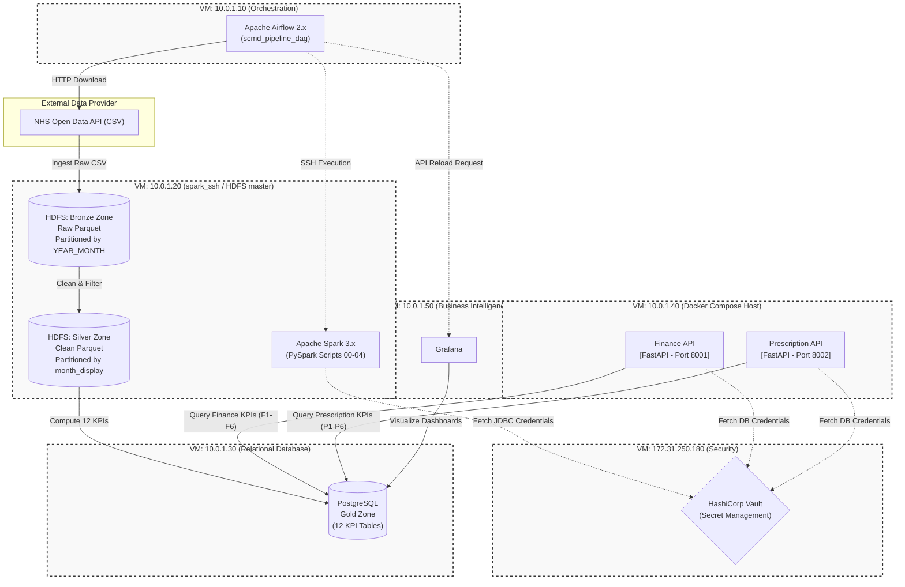

# SCMD Pipeline & Microservices Architecture

This diagram illustrates the infrastructure and application components making up the SCMD (Secondary Care Medicines Data) pipeline and its serving layer. The infrastructure is represented by boxes identified by their target IP addresses.

